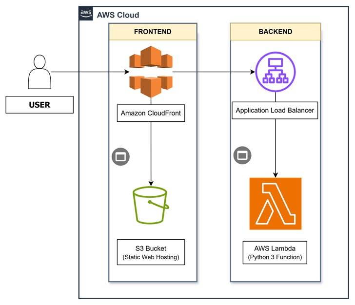
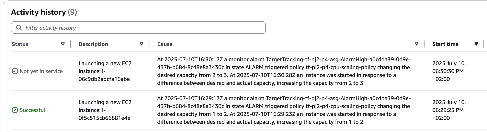

## Prepare

Edit ~/.aws/credentials and put aws credentials in

Install terraform https://developer.hashicorp.com/terraform/tutorials/aws-get-started/install-cli

# Project 1

### Architecture



### Terraform
```
$ cd project-1/terraform
```
### Init
```
$ terraform init
```
```
$ terraform plan
```
### Deploy to aws
```
$ terraform apply -auto-approve
```
### Test project 1

Open frontend

[Cloudfront URL: http://d2vky7lfbvwa5o.cloudfront.net](http://d2vky7lfbvwa5o.cloudfront.net)

Check backend

[Link backend http://tf-pj1-dev-lambda-alb-1377999723.us-east-1.elb.amazonaws.com](http://tf-pj1-dev-lambda-alb-1377999723.us-east-1.elb.amazonaws.com)

```
$ curl -X POST http://tf-pj1-dev-lambda-alb-1377999723.us-east-1.elb.amazonaws.com -H "Content-Type: application/json"   -d '{"name":"Arya", "age":16}'
```

### Destroy all

```
$ terraform destroy -auto-approve
```

# Project 2

## Project 2 - Phrase 1

### Architecture

### Cost estimation

## Project 2 - Phrase 2

```
$ terraform apply -auto-approve
```

Open website:

[Web IP: http://52.21.170.174](http://52.21.170.174)

Test/add serveral student

## Project 2 - Phrase 3

```
$ terraform apply -auto-approve
```

### Migration db

#### Add Lab Profile for cloud9

Install Session Manager Plugin

- macos
```
brew install --cask session-manager-plugin
```

linux:
```
curl "https://s3.amazonaws.com/session-manager-downloads/plugin/latest/ubuntu_64bit/session-manager-plugin.deb" -o "session-manager-plugin.deb"
sudo dpkg -i session-manager-plugin.deb

```

```
aws ec2 associate-iam-instance-profile \
  --instance-id i-xxxxxxx \
  --iam-instance-profile Name=LabInstanceProfile
aws ec2 reboot-instances --instance-ids i-xxx

```

### Connect to cloud9

```
aws ssm start-session --target i-xxx
```

- Dump database
```
sh-4.2$ mysqldump -h 10.0.1.33 -u nodeapp -p --databases STUDENTS > data.sql
Enter password:
sh-4.2$ cat data.sql
/*M!999999\- enable the sandbox mode */
-- MariaDB dump 10.19  Distrib 10.5.29-MariaDB, for Linux (x86_64)
--
-- Host: 10.0.1.33    Database: STUDENTS
-- ------------------------------------------------------
-- Server version	8.0.42-0ubuntu0.20.04.1
```

- Import database
```
$ mysql -h tf-pj2-ph3-app-db.c3ousaeg01v3.us-east-1.rds.amazonaws.com -u nodeapp -p  STUDENTS < data.sql
Enter password:
```

### Load test

```
npm install -g loadtest
```

```
loadtest --rps 1000  -c 500 -k http://tf-pj2-p4-alb-1603761629.us-east-1.elb.amazonaws.com/students

Target URL:          http://tf-pj2-p4-alb-1603761629.us-east-1.elb.amazonaws.com
Max time (s):        10
Target rps:          1000
Concurrent clients:  481
Running on cores:    5
Agent:               keepalive

Completed requests:  9730
Total errors:        0
Total time:          10.015 s
Mean latency:        220.2 ms
Effective rps:       972

Percentage of requests served within a certain time
  50%      194 ms
  90%      330 ms
  95%      386 ms
  99%      761 ms
 100%      2499 ms (longest request)

```

-> Database died.


```
loadtest -n 1000000 -c 100 -k http://tf-pj2-p4-alb-1603761629.us-east-1.elb.amazonaws.com
```


# Useful command

view log
```
tail -f /var/log/cloud-init.log -n 100

tail -f /var/log/cloud-init-output.log
```

kill process
```
sudo lsof -i :80

sudo kill -9 <PID>

```