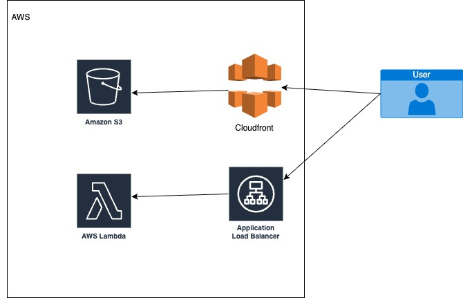

## Prepare

Edit ~/.aws/credentials and put aws credentials in

Install terraform https://developer.hashicorp.com/terraform/tutorials/aws-get-started/install-cli

## Project 1

### Architecture

### Terraform
$ cd project-1/terraform

### Init
$ terraform init

$ terraform plan

### Deploy to aws

$ terraform apply -auto-approve

### Test project 1

Open frontend

[Cloudfront URL: http://d2vky7lfbvwa5o.cloudfront.net](http://d2vky7lfbvwa5o.cloudfront.net)

Check backend

[Link backend http://tf-pj1-dev-lambda-alb-1377999723.us-east-1.elb.amazonaws.com](http://tf-pj1-dev-lambda-alb-1377999723.us-east-1.elb.amazonaws.com)

$ curl -X POST http://tf-pj1-dev-lambda-alb-1377999723.us-east-1.elb.amazonaws.com -H "Content-Type: application/json"   -d '{"name":"Arya", "age":16}'

### Destroy all

$ terraform destroy -auto-approve

## Project 2 - Phrase 2

$ terraform apply -auto-approve

##